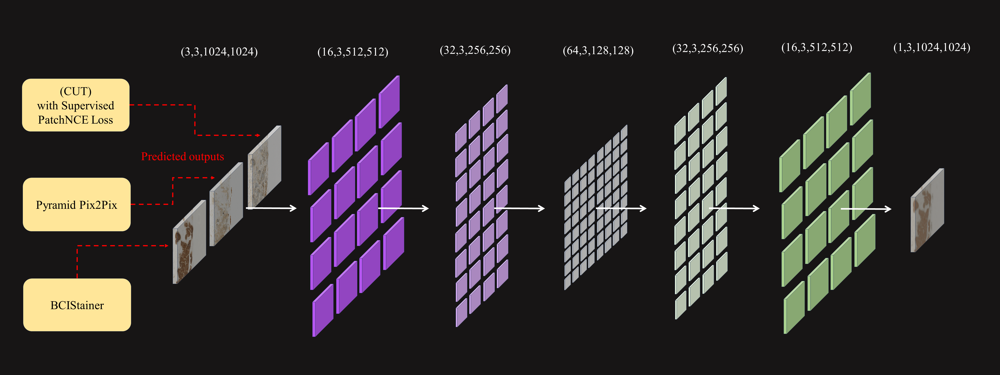

# BCI fusion

## Datasets

We strongly encourage you to clone the repositories, and evaluate the output of the three models yourself using these links:  

BCIStainer: [git-hub link](https://github.com/quqixun/BCIStainer)  
Pyramid Pix2Pix: [git-hub link](https://github.com/bupt-ai-cz/BCI)  
(CUT) with Supervised PatchNCE Loss: [git-hub link](https://github.com/lifangda01/AdaptiveSupervisedPatchNCE)  
The BCI dataset itself can be accessed through [bci page](https://bupt-ai-cz.github.io/BCI/)  

However, we provide you with the evaluated images from the three methods, and you can access them using these links:  
BCIStainer: [google drive](https://drive.google.com/drive/folders/1ELjMqUxp5qPB_J2W75jcrXdlAZcKqLSf?usp=sharing)  
Pyramid Pix2Pix: [google drive](https://drive.google.com/drive/folders/1AiANjhZOaffYBCPvcp1Ia7_FEbAzO4ws?usp=sharing)  
(CUT) with Supervised PatchNCE Loss: [google drive](https://drive.google.com/drive/folders/18eLOR8Dn0UF8RAjZ27O6xqG_xb4ntwln?usp=sharing)  

## Requirements

```bash
pip install -r requirements.txt
```
## Training and Evaluation
for maximum convenience we implemented all of the code in a single jupyter notebook file, which can be used on any platform (windows, linux, colab, ...). The markdowns in the file guide you throughly on how to train or evaluate the model.  
The trained weights are available on [google drive](https://drive.google.com/file/d/10DvhvqvoWuqf4gcuA-bjh0sKkVgY2Iw4/view?usp=sharing) which you can use to avoid training from scratch.  
the code is simple and easy to understand. Feel free to change any part as you wish.  

## Environment

All the code is run on colab and does not require a high-end GPU.


