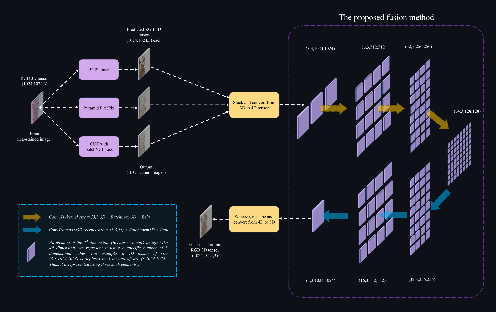

# Tri-Model Integration: Advancing Breast Cancer Immunohistochemical Image Generation through Multi-Method Fusion
### Arsham Haqiqat



> Immunohistochemical (IHC) staining is a crucial technique for diagnosing and formulating treatment plans for breast cancer, particularly by evaluating the expression of biomarkers like human epidermal growth factor receptor-2. However, the high cost and complexity of IHC staining procedures have driven research toward generating IHC-stained images directly from more readily available Hematoxylin and Eosin-stained images using image-to-image (I2I) translation methods. In this work, we propose a novel approach that combines the predictive capabilities of three state-of-the-art I2I models to enhance the quality and reliability of synthetic IHC images. Specifically, we designed a Convolutional Neural Network that takes as input a four-dimensional input comprising the outputs of three distinct models (each contributing an IHC prediction, which is an RGB three-dimensional output for each) and produces a final consensus image through a fusion mechanism. This ensemble method leverages the strengths of each individual model, leading to more robust and accurate IHC image generation. Extensive experiments on the BCI dataset demonstrate that our approach outperforms existing single-model methods, achieving superior Peak Signal-to-Noise Ratio (PSNR) and Structural Similarity Index (SSIM) metrics.

## Results

| Model                       | PSNR (dB) | SSIM  |
|-----------------------------|-----------|-------|
| CycleGAN (Unsupervised) [12] | 16.203    | 0.373 |
| Pix2PixHD [9]               | 19.634    | 0.471 |
| Pyramid Pix2Pix [2]         | 21.160    | 0.477 |
| BCIStainer [4]              | 22.929    | 0.559 |
| CUT with PatchNCE [10]       | 17.927    | 0.555 |
| **Our Fusion Model**        | **23.206**| **0.614** |

## Datasets

We strongly encourage you to clone the repositories, and evaluate the output of the three models yourself using these links:  

BCIStainer: [git-hub link](https://github.com/quqixun/BCIStainer)  
Pyramid Pix2Pix: [git-hub link](https://github.com/bupt-ai-cz/BCI)  
(CUT) with Supervised PatchNCE Loss: [git-hub link](https://github.com/lifangda01/AdaptiveSupervisedPatchNCE)  
The BCI dataset itself can be accessed through [bci page](https://bupt-ai-cz.github.io/BCI/)  

However, we provide you with the evaluated images from the three methods, and you can access them using these links:  
BCIStainer: [google drive](https://drive.google.com/drive/folders/1ELjMqUxp5qPB_J2W75jcrXdlAZcKqLSf?usp=sharing)  
Pyramid Pix2Pix: [google drive](https://drive.google.com/drive/folders/1AiANjhZOaffYBCPvcp1Ia7_FEbAzO4ws?usp=sharing)  
(CUT) with Supervised PatchNCE Loss: [google drive](https://drive.google.com/drive/folders/18eLOR8Dn0UF8RAjZ27O6xqG_xb4ntwln?usp=sharing)  

## Requirements

```bash
pip install -r requirements.txt
```
## Training and Evaluation
for maximum convenience we implemented all of the code in a single jupyter notebook file, which can be used on any platform (windows, linux, colab, ...). The markdowns in the file guide you thoroughly on how to train or evaluate the model.  
The trained weights are available on [google drive](https://drive.google.com/file/d/10DvhvqvoWuqf4gcuA-bjh0sKkVgY2Iw4/view?usp=sharing) which you can use to avoid training from scratch.  
the code is simple and easy to understand. Feel free to change any part as you wish.  

## Environment

All the code is run on colab and does not require a high-end GPU.

## References

[2]   S. Liu, C. Zhu, F. Xu, X. Jia, Z. Shi, and M. Jin. Bci: Breast cancer immunohistochemical image generation through pyramid pix2pix, 2022.

[4] 	C. Zhu, S. Liu, Z. Yu, F. Xu, A. Aggarwal, G. Corredor, A. Madabhushi, Q. Qu, H. Fan, F. Li, Y. Li, X. Guan, Y. Zhang, V. K. Singh, F. Akram, M. M. K. Sarker, Z. Shi, and M. Jin. Breast cancer immunohistochemical image generation: a benchmark dataset and challenge review, 2023.

[9]	  Ting-Chun Wang, Ming-Yu Liu, Jun-Yan Zhu, Andrew Tao, Jan Kautz, and Bryan Catanzaro. High-resolution image synthesis and semantic manipulation with conditional gans. In Proceedings of the IEEE conference on computer vision and pattern recognition, pages 8798–8807, 2018.

[10]	Lingke Kong, Chenyu Lian, Detian Huang, Zhenjiang Li, Yanle Hu, and Qichao Zhou. Breaking the dilemma of medical image-to-image translation. arXiv preprint arXiv:2110.06465, 2021.

[12]	J.-Y. Zhu, T. Park, P. Isola, and A. A. Efros. Unpaired image-to-image translation using cycle-consistent adversarial networks. In 2017 IEEE International Conference on Computer Vision (ICCV), pages 2242–2251, 2017.


